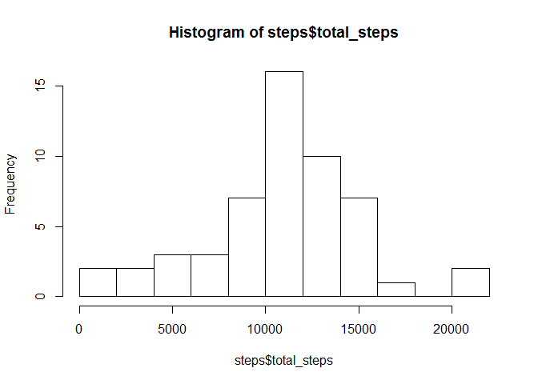
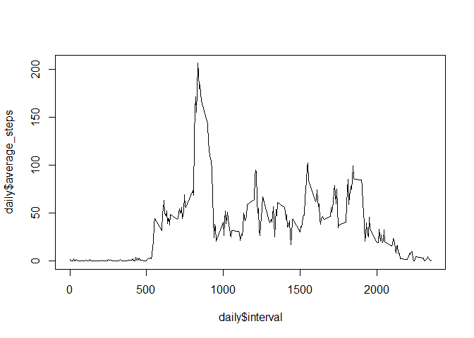
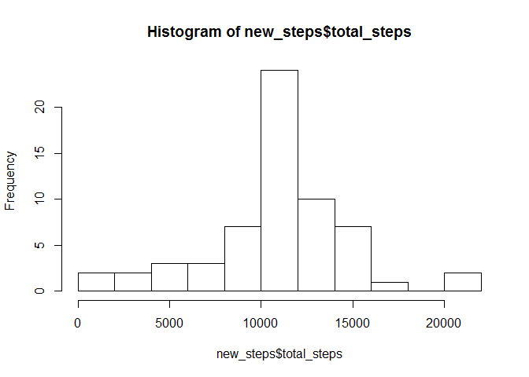
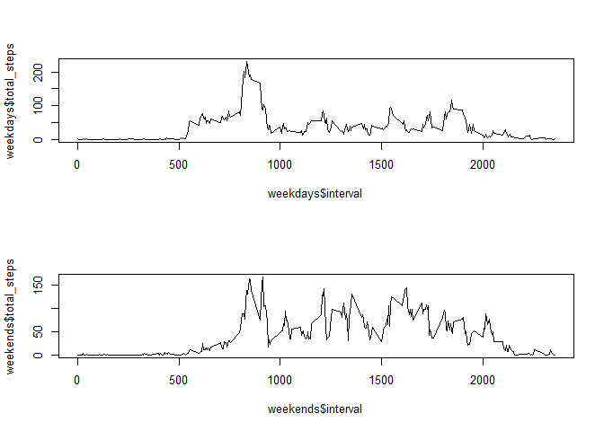

## Loading and preprocessing the data

```r
unzip("activity.zip")
activity <- read.csv("activity.csv")
```

## What is mean total number of steps taken per day?

```r
require(dplyr)
```

```
## Loading required package: dplyr
```

```
## Warning: Installed Rcpp (0.12.10) different from Rcpp used to build dplyr (0.12.11).
## Please reinstall dplyr to avoid random crashes or undefined behavior.
```

```
## 
## Attaching package: 'dplyr'
```

```
## The following objects are masked from 'package:stats':
## 
##     filter, lag
```

```
## The following objects are masked from 'package:base':
## 
##     intersect, setdiff, setequal, union
```

```r
steps <- activity %>%
  group_by(date) %>%
  summarise(total_steps=sum(steps))
hist(steps$total_steps, breaks=10)
```

<!-- -->

```r
mean(steps$total_steps, na.rm=TRUE)
```

```
## [1] 10766.19
```

```r
median(steps$total_steps, na.rm=TRUE)
```

```
## [1] 10765
```

## What is the average daily activity pattern?

```r
daily <- activity %>%
  group_by(interval) %>%
  summarise(average_steps=mean(steps, na.rm=TRUE))

plot(x=daily$interval, y=daily$average_steps, type="l")
```

<!-- -->

```r
daily[order(-daily$average_steps),][1,]
```

```
## # A tibble: 1 x 2
##   interval average_steps
##      <int>         <dbl>
## 1      835      206.1698
```

## Imputing missing values

```r
count(activity %>% filter(is.na(steps)))
```

```
## # A tibble: 1 x 1
##       n
##   <int>
## 1  2304
```

```r
#use average steps by interval as calculated above for missing value imputation
new_activity <- activity %>%
  left_join(daily, by="interval") %>%
  transmute(steps=ifelse(is.na(steps), average_steps, steps), date=date, interval=interval)

new_steps <- new_activity %>% group_by(date) %>% summarise(total_steps=sum(steps))
hist(new_steps$total_steps, breaks=10)
```

<!-- -->

```r
mean(new_steps$total_steps)
```

```
## [1] 10766.19
```

```r
median(new_steps$total_steps)
```

```
## [1] 10766.19
```
There is little difference between the mean and median from the first part of the assignment. This is because the missing data was imputed using the average of the initial data.

## Are there differences in activity patterns between weekdays and weekends?

```r
int_steps <- new_activity %>% group_by(date, interval) %>% summarise(total_steps=sum(steps))
day_type <- int_steps %>%
  mutate(day_type=ifelse(weekdays(as.Date(date)) %in% c("Saturday", "Sunday"), "weekend", "weekday"))

layout(matrix(c(1,1,2,2), 2, 2, byrow=TRUE))
weekdays <- day_type %>%
  filter(day_type == "weekday") %>%
  group_by(interval) %>%
  summarise(total_steps=mean(total_steps))
plot(x=weekdays$interval, y=weekdays$total_steps, type="l")

weekends <- day_type %>%
  filter(day_type == "weekend") %>%
  group_by(interval) %>%
  summarise(total_steps=mean(total_steps))
plot(x=weekends$interval, y=weekends$total_steps, type="l")
```

<!-- -->
